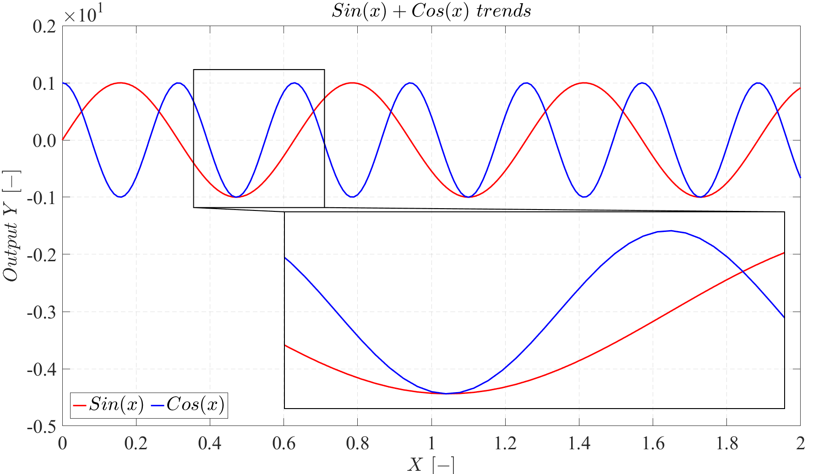
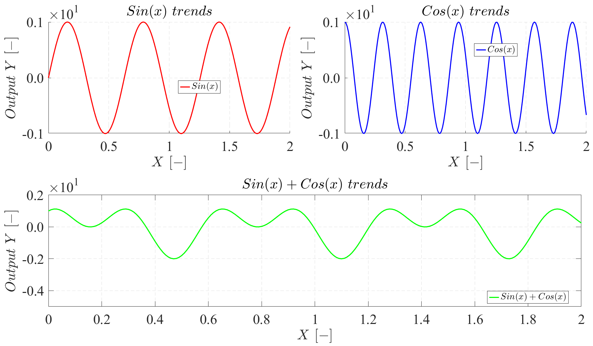
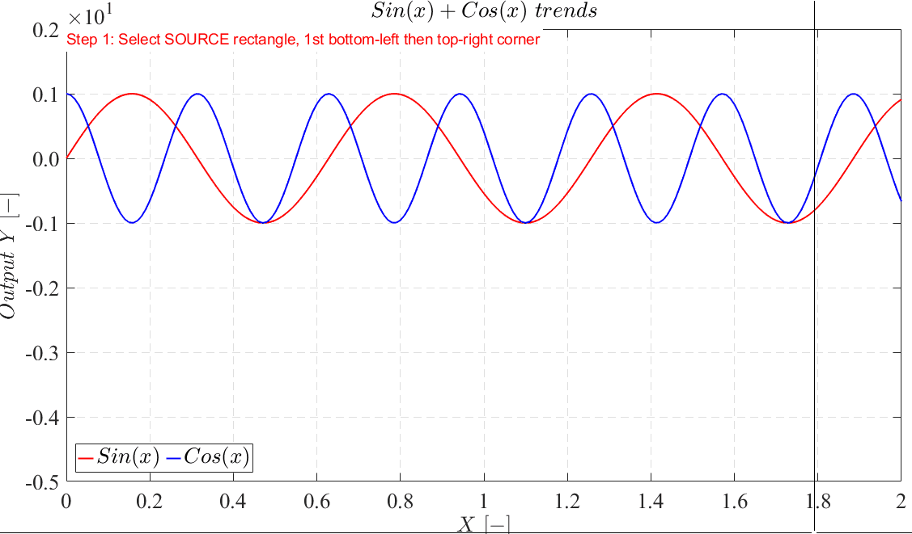

# MATLAB Professional Plots

- [MATLAB Professional Plots](#matlab-professional-plots)
- [Single plots](#single-plots)
- [Multiple sub-plots](#multiple-sub-plots)
- [Zoom plots](#zoom-plots)


This script is to help researchers and alike produce manuscript-worthy plots in MATLAB without having to do too much work.

it has 3 main components
- sample plotting practises
- maximizing plot area using subplotter function
- adding zoom sub-axis to your plot for magnification

# Single plots
An example of a single plot with zoomed axes is shown below



# Multiple sub-plots
For multiple sub-plots, we use a great function developed by [Eduard Reitmann](https://www.mathworks.com/matlabcentral/fileexchange/68326-border-less-tight-subplot-auto-refresh?s_tid=prof_contriblnk) note that you have to make your figure invisible first for this function to work properly and after all your work is done make it visible again.

Additionally, an example of multiple sub-plots is shown below


# Zoom plots
There is a function written by Dr. Rahimi to help quickly and if needed interactively add zoom plots to your existing axes.

you can simply call the function with 
```matlab
zoomPlot(ax(1),[],[],[],"showTicks","off");
```

**Note** that if you leave the 2nd, 3rd, and 4th, elements in the function as empty (i.e.,[]) then the function will work interactively to help you place your zoomed axes on your main axis. It will also give you the final elements in the command window so you can use it in future to hard-code them in your main script after you identify the elements interactively

Below is a quick animation of the functionality of the function


After you finalized your zoom plot with interactions as showns above, the function shows the final values for the not-given elements in teh command window something similar to below

```matlab
desLoc, srcLoc, conVec = [0.602  -5 1.96 -1.26], [0.356 -1.18 0.71 1.23], [3 4 2 1]
```

With this information you can update your code to have this vectors hard-coded in the main script so you don't have to do the interactions every time you run your code. So you would end up with something similar to below

```matlab
zoomPlot(ax(1),[0.602  -5 1.96 -1.26], [0.356 -1.18 0.71 1.23], [3 4 2 1],"showTicks","off");
```

Note that you can have any of the 3 elments inputted as empty (i.e., []) and if they are empty, the function (zoomPlot) will either ask you to input them (for srcLoc and desLoc) or automatically determines their value (conVec)

below is a list of all arguments and options for zoomPlot function
```matlab
    arguments
        srcAx handle
        desLoc double
        srcLoc double
        conVec double
        options.showTicks {mustBeMember(options.showTicks,["on","off"])} = "on"
        options.showGridline {mustBeMember(options.showGridline,["on","off"])} = "off"
        options.axisBackColor string = 'none'
        options.boxColor string = 'k'
        options.lineColor string = 'k'
        options.boxStyle (1,1) string = '-'
        options.lineStyle (1,1) string = '-'
        options.lineWidth (1,1) {mustBeNumeric} = 1
    end
```
    
and here is additional information on the function and its inputs and outputs

```matlab
%%% This function add a magnified axis to the given axis to amplify the
%%% visibility of smaller details in the given axis

% Inputs
% srcAx  = given axis to the add a magnified axis to
% desLoc = destination axis, aka where the magnified axis is going to be 
%          added in the source axis coordinates 
%          [leftx bottomx rightx topx] all in src coordinate
% srcLoc = source axis, aka the axis you want to add magnification to 
%          highlight some details 
%          [leftx bottomx rightx topx] all in src coordinate
% conVec = connection vector, check the position of src and dees boxes for 
%          conneting lines. conVec goes from topLeft, topRight, bottomRight, 
%          bottomLeft in order of 1,2,3,4 resepctively. The first 2 are the 
%          location of the source axis and the second 2 are the locations 
%          of the des axis. For example [1,2,3,4] will connect the topLeft 
%          of the source to bottomRight of the des and topRight of the source 
%          to bottomLeft of the des
%
% Output
% desAx = the added axis to the given axis (srcAx)
```